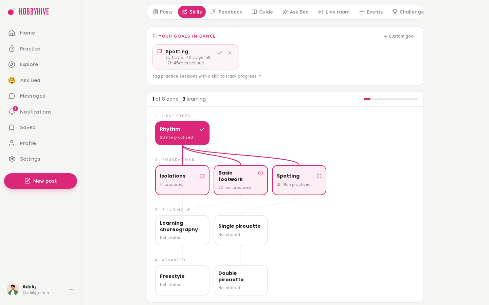
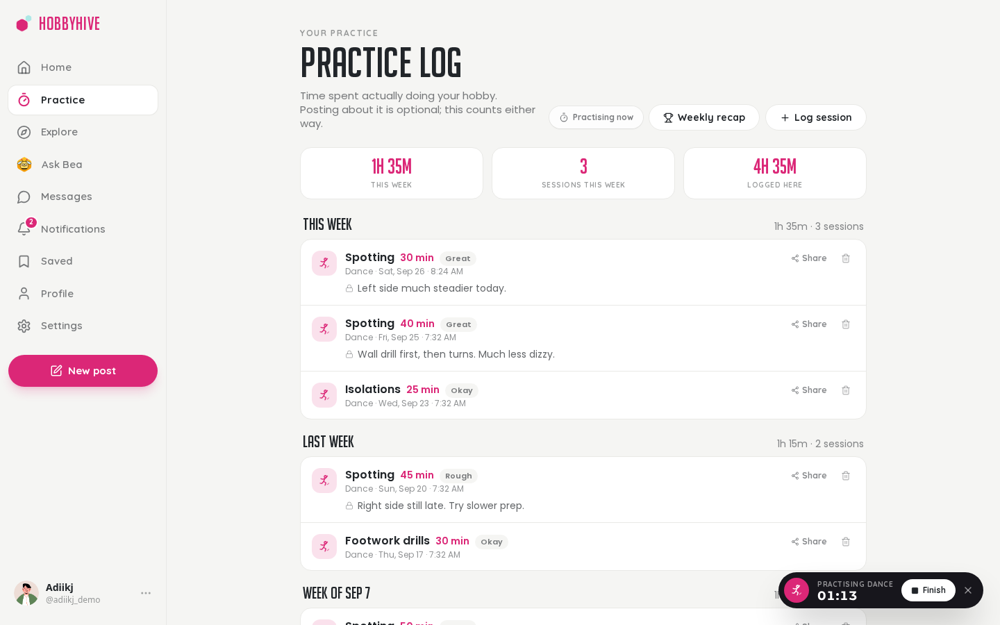
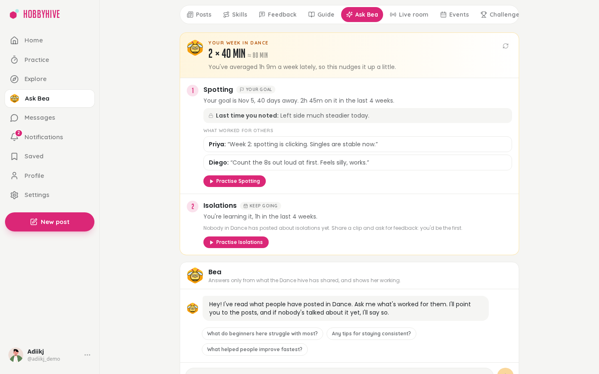
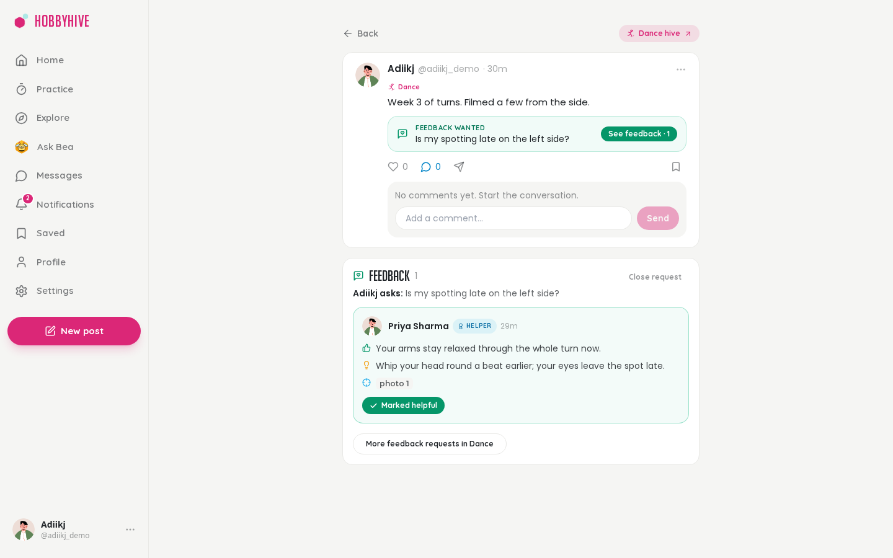
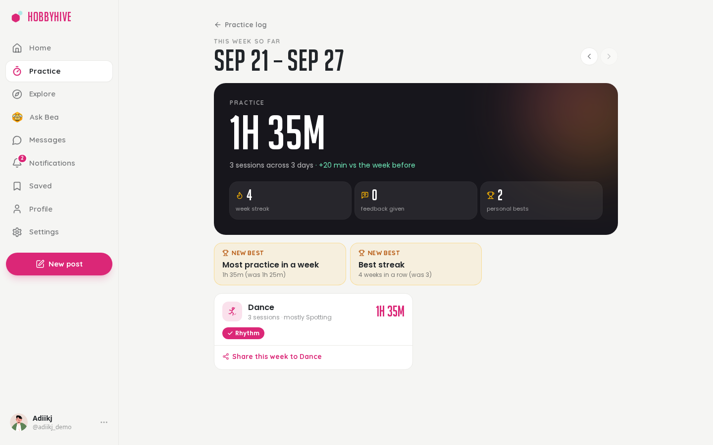
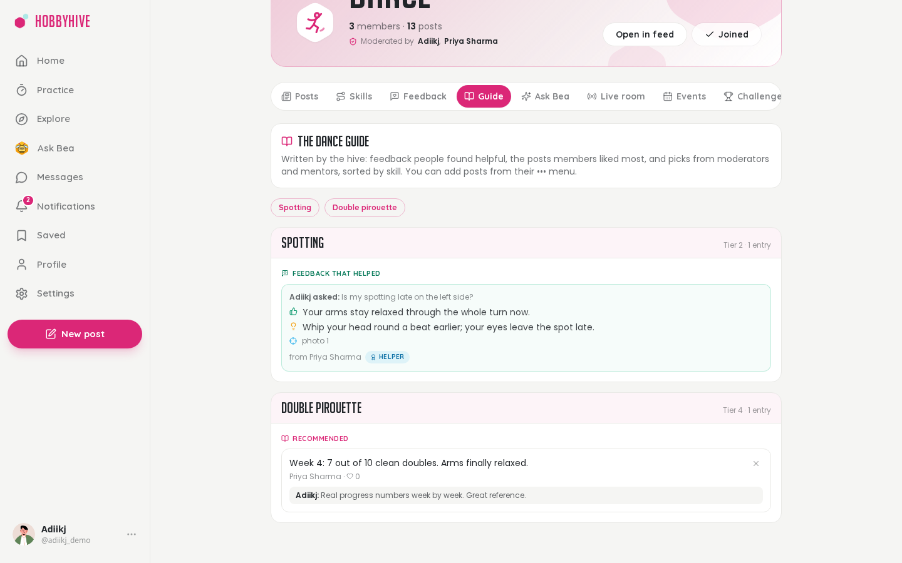

<h1 align="center">HobbyHive</h1>

<p align="center"><b>Your hobby. Your hive.</b><br>A hobby app that rewards doing the hobby, not posting about it: practice tracking, skill maps, structured feedback from people who've been there, and an AI coach grounded in what the community has actually shared.</p>

<p align="center">
  
  
  
  
  
</p>


## Why

Social apps measure posts and likes. Getting better at a hobby is about practice, knowing what to work on next, and honest feedback. Each hobby on HobbyHive is its own hive, built around that.

## Features

- **Practice:** a timer that follows you around the app, a practice log, and streaks that count practice (posting is optional)
- **Skills and goals:** a curated skill map per hive, "learn X by then" goals, profiles that show skills rather than follower counts
- **Feedback requests:** ask something specific; replies are "what's working" and "one thing to try", and helpful replies earn mentor levels
- **Bea, the practice coach:** plans your week from your own sessions and goals, backed by cited posts from the hive
- **Weekly recap** with personal bests, shareable to the hive
- **Hive guides:** helpful feedback and top posts sorted by skill, curated by moderators and mentors
- Also: hive feeds, weekly challenges, live rooms, events, DMs, explore, saved collections, dark mode

<table>
  <tr>
    <td><p align="center"><sub>Skill map and goals</sub></p></td>
    <td><p align="center"><sub>Practice log and running timer</sub></p></td>
  </tr>
  <tr>
    <td><p align="center"><sub>Bea's weekly plan, with cited tips</sub></p></td>
    <td><p align="center"><sub>Structured feedback</sub></p></td>
  </tr>
  <tr>
    <td><p align="center"><sub>Weekly recap</sub></p></td>
    <td><p align="center"><sub>Hive guide</sub></p></td>
  </tr>
  <tr>
    <td><p align="center"><sub>Profile: skills first</sub></p></td>
    <td><p align="center"><sub>Dark mode</sub></p></td>
  </tr>
  <tr>
    <td colspan="2"><p align="center"><sub>Landing page</sub></p></td>
  </tr>
</table>

## AI features (all local, no paid APIs)

| Feature | How |
|---|---|
| Hive suggestion and off-topic flagging | `bge-small` embeddings + logistic regression (79% accuracy on 13 classes) |
| Search by meaning | pgvector cosine similarity + topic score (top-3 quality 0.57 → 0.90) |
| Ask Bea | RAG: BM25 + dense retrieval fused with RRF, cut-off tuned by evaluation, extractive answers with citations; declines when the hive has no answer |
| Practice coach | Rule-based plan from your sessions, goals and skill map; tips from the same retrieval, kept only when clearly on-topic |

Details and evaluation reports: [`apps/ml`](apps/ml/README.md).

## Architecture

```
apps/frontend   Next.js 15 + Tailwind        :3000   proxies /api and /socket.io to the backend
apps/backend    Express + Prisma + Socket.IO :8000   auth, posts, hives, practice, chat
apps/ml         FastAPI + ONNX Runtime       :8002   embeddings, topic model, Ask Bea
deploy/         systemd units for a 1 GB VM (API + ML in ~400 MB)
```

The ML service is optional. Without it, the app works and the AI features switch off.

## Quick start

Needs Node 20+, pnpm, [uv](https://docs.astral.sh/uv/) and Postgres with the `pgvector` extension (a free [Neon](https://neon.tech) database works).

```bash
pnpm install
cp apps/backend/.env.example apps/backend/.env      # set DATABASE_URL and token secrets
cp apps/frontend/.env.example apps/frontend/.env
pnpm db:migrate
pnpm --filter @hobbyhive/backend db:seed            # hives and their skill maps
pnpm --filter @hobbyhive/backend db:seed:demo       # demo users and posts
(cd apps/ml && uv sync)                             # optional: AI features (trained model is committed)
npm run dev                                         # frontend, backend and ML together
pnpm --filter @hobbyhive/backend ml:backfill --all  # once, with ML running: index existing posts
```

Open http://localhost:3000 and sign in as `adiikj@hobbyhive.test` / `DemoPassword123!` (the demo account).

Tests: `pnpm test` (app) and `cd apps/ml && uv run pytest` (ML).
