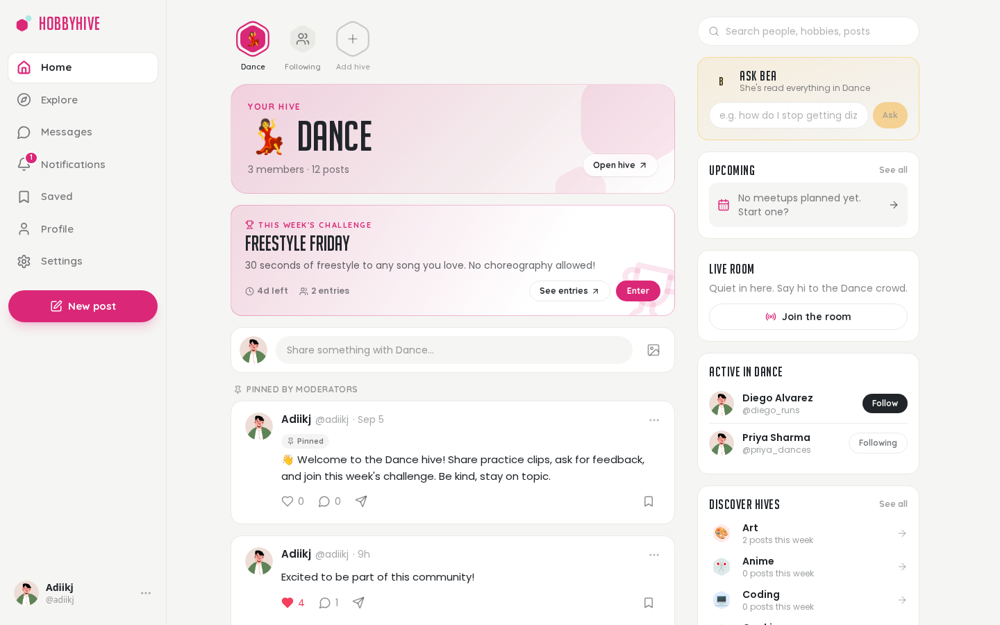
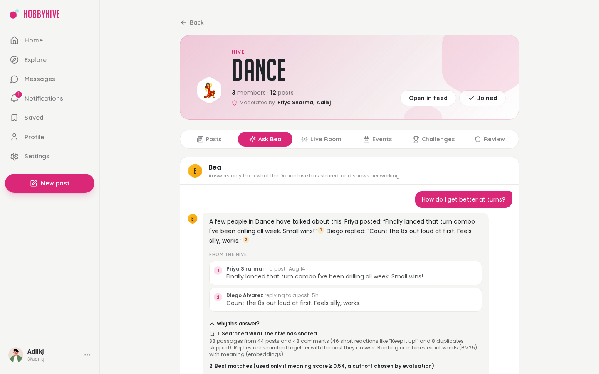
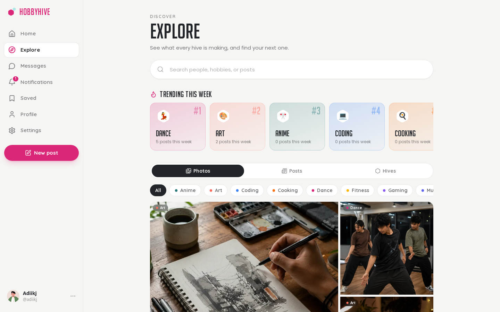
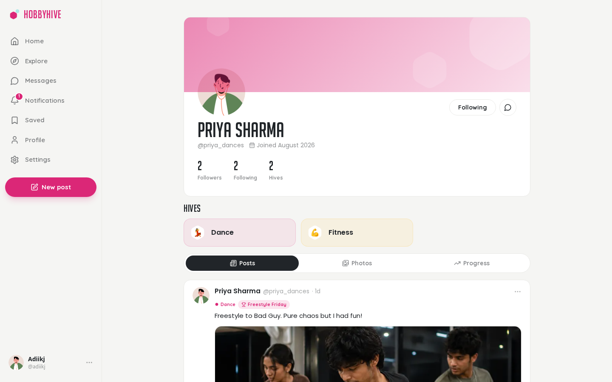
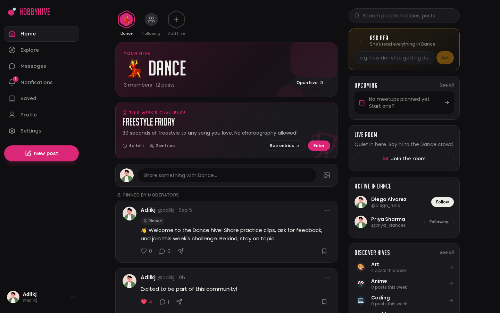
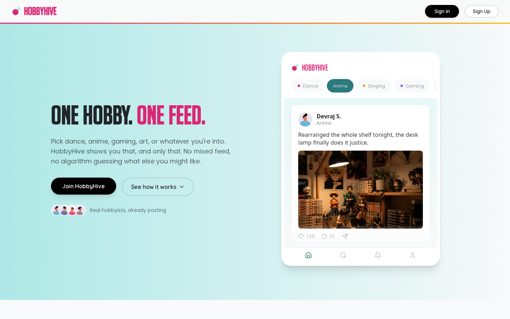

<h1 align="center">HobbyHive</h1>

<p align="center"><b>One hobby. One feed.</b><br>A social app where every hobby gets its own hive: a focused feed, weekly challenges, live rooms and an AI assistant that answers from what the community has actually shared.</p>

<p align="center">
  
  
  
  
  
</p>



## Why

Mixed feeds bury what you came for. On HobbyHive you pick dance, coding, art or whatever you're into, and you see that hobby only, alongside the people who share it.

## Features

- **Hives:** one feed per hobby, moderators, pinned posts, a review queue for off-topic posts
- **Weekly challenges** with entries, plus **events** and **progress** tracking
- **Live rooms** and **direct messages** (Socket.IO)
- **Explore:** trending hives, photo grid, search by meaning
- **Profiles, follows, saved collections, notifications, dark mode**
- **Ask Bea:** an assistant that answers questions using only the hive's posts and comments, cites every source and shows how it got there

<table>
  <tr>
    <td><p align="center"><sub>Ask Bea: cited answers and a "Why this answer?" trace</sub></p></td>
    <td><p align="center"><sub>Explore</sub></p></td>
  </tr>
  <tr>
    <td><p align="center"><sub>Profile</sub></p></td>
    <td><p align="center"><sub>Dark mode</sub></p></td>
  </tr>
  <tr>
    <td colspan="2"><p align="center"><sub>Landing page</sub></p></td>
  </tr>
</table>

## AI features (all local, no paid APIs)

| Feature | How |
|---|---|
| Hive suggestion and off-topic flagging | `bge-small` embeddings + logistic regression (79% accuracy on 13 classes) |
| Search by meaning | pgvector cosine similarity + topic score (top-3 quality 0.57 → 0.90) |
| Ask Bea | RAG: BM25 + dense retrieval fused with RRF, cut-off tuned by evaluation, extractive answers with citations; declines when the hive has no answer |

Details and evaluation reports: [`apps/ml`](apps/ml/README.md).

## Architecture

```
apps/frontend   Next.js 15 + Tailwind        :3000   proxies /api and /socket.io to the backend
apps/backend    Express + Prisma + Socket.IO :8000   auth, posts, hives, chat
apps/ml         FastAPI + ONNX Runtime       :8002   embeddings, topic model, Ask Bea
deploy/         systemd units for a 1 GB VM (API + ML in ~400 MB)
```

The ML service is optional. Without it, the app works and the AI features switch off.

## Quick start

Needs Node 20+, pnpm, [uv](https://docs.astral.sh/uv/) and Postgres with the `pgvector` extension (a free [Neon](https://neon.tech) database works).

```bash
pnpm install
cp apps/backend/.env.example apps/backend/.env      # set DATABASE_URL and token secrets
cp apps/frontend/.env.example apps/frontend/.env
pnpm db:migrate
pnpm --filter @hobbyhive/backend db:seed
pnpm --filter @hobbyhive/backend db:seed:demo       # demo users and posts
(cd apps/ml && uv sync)                             # optional: AI features (trained model is committed)
npm run dev                                         # frontend, backend and ML together
pnpm --filter @hobbyhive/backend ml:backfill --all  # once, with ML running: index existing posts
```

Open http://localhost:3000 and sign in as `adiikj` / `DemoPassword123!` (the demo account).

Tests: `pnpm test` (app) and `cd apps/ml && uv run pytest` (ML).
