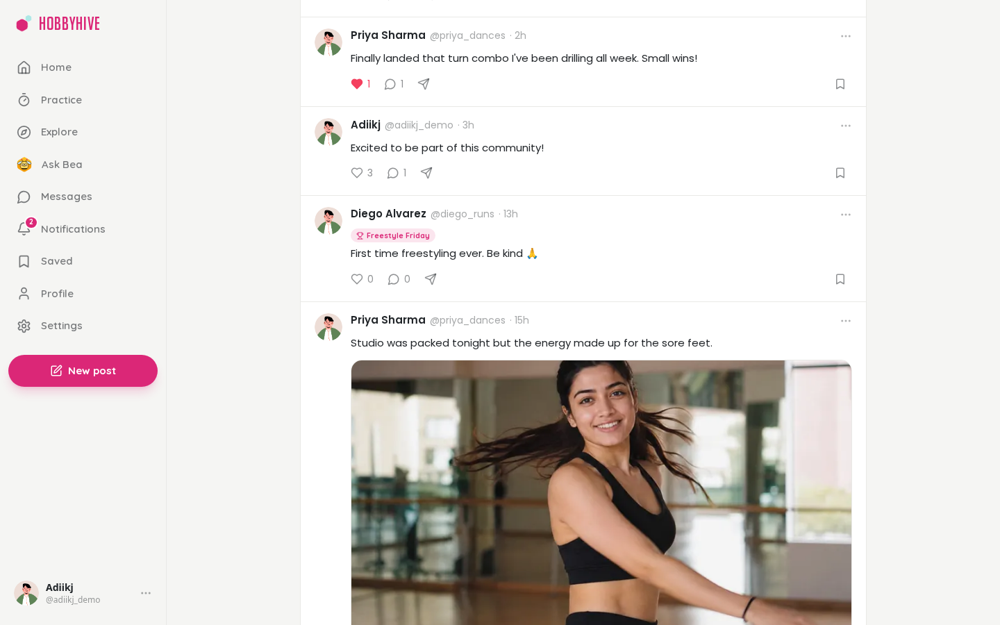

<h1 align="center">HobbyHive</h1>

<p align="center"><b>Your hobby. Your hive.</b><br>Post about your hobby to people who share it. Each hobby is its own hive, so your feed is only what you picked, and the likes, comments and streaks keep you coming back until the hobby becomes a habit.</p>

<p align="center">
  
  
  
  
  
</p>


## Why

On a general social app, your dance clip sits between politics, ads and someone's lunch, in front of people who don't care about dance. On HobbyHive you pick your hobbies and each one is its own contained hive: you post to people who get it, and they see only that hobby.

That audience is the point. A like or a comment from someone who knows how hard a clean double pirouette is feels good, so you practise, post again, and keep your streak alive. Repeated, that's a habit. Everything else in the app (practice tracking, skill maps, feedback, Bea) feeds that loop.

## Features

- **Hives:** one contained feed per hobby with posts, photos, likes, comments and @mentions, plus weekly challenges, live rooms and events
- **Streaks:** posting or logging practice each week keeps your streak going; a practice timer and log sit alongside your posts
- **Skills and goals:** a curated skill map per hive, "learn X by then" goals, and profiles that show what you've learned
- **Feedback requests:** ask something specific; replies are "what's working" and "one thing to try", and helpful replies earn mentor levels
- **Bea, the practice coach:** plans your week from your own sessions and goals, backed by cited posts from the hive
- **Weekly recap** with personal bests, shareable to the hive
- **Hive guides:** helpful feedback and top posts sorted by skill, curated by moderators and mentors
- Also: DMs, explore, saved collections, notifications, dark mode

<table>
  <tr>
    <td><p align="center"><sub>A hive's feed: only that hobby</sub></p></td>
    <td><p align="center"><sub>Asking the hive for feedback</sub></p></td>
  </tr>
  <tr>
    <td><p align="center"><sub>Skill map and goals</sub></p></td>
    <td><p align="center"><sub>Practice log and running timer</sub></p></td>
  </tr>
  <tr>
    <td><p align="center"><sub>Bea's weekly plan, with cited tips</sub></p></td>
    <td><p align="center"><sub>Weekly recap</sub></p></td>
  </tr>
  <tr>
    <td><p align="center"><sub>Hive guide</sub></p></td>
    <td><p align="center"><sub>Profile</sub></p></td>
  </tr>
  <tr>
    <td colspan="2"><p align="center"><sub>Dark mode</sub></p></td>
  </tr>
  <tr>
    <td colspan="2"><p align="center"><sub>Landing page</sub></p></td>
  </tr>
</table>

## AI features (all local, no paid APIs)

| Feature | How |
|---|---|
| Hive suggestion and off-topic flagging | `bge-small` embeddings + logistic regression (79% accuracy on 13 classes) |
| Search by meaning | pgvector cosine similarity + topic score (top-3 quality 0.57 → 0.90) |
| Ask Bea | RAG: BM25 + dense retrieval fused with RRF, cut-off tuned by evaluation, extractive answers with citations; declines when the hive has no answer |
| Practice coach | Rule-based plan from your sessions, goals and skill map; tips from the same retrieval, kept only when clearly on-topic |

Details and evaluation reports: [`apps/ml`](apps/ml/README.md).

## Architecture

```
apps/frontend   Next.js 15 + Tailwind        :3000   proxies /api and /socket.io to the backend
apps/backend    Express + Prisma + Socket.IO :8000   auth, posts, hives, practice, chat
apps/ml         FastAPI + ONNX Runtime       :8002   embeddings, topic model, Ask Bea
deploy/         systemd units for a 1 GB VM (API + ML in ~400 MB)
```

The ML service is optional. Without it, the app works and the AI features switch off.

## Quick start

Needs Node 20+, pnpm, [uv](https://docs.astral.sh/uv/) and Postgres with the `pgvector` extension (a free [Neon](https://neon.tech) database works).

```bash
pnpm install
cp apps/backend/.env.example apps/backend/.env      # set DATABASE_URL and token secrets
cp apps/frontend/.env.example apps/frontend/.env
pnpm db:migrate
pnpm --filter @hobbyhive/backend db:seed            # hives and their skill maps
pnpm --filter @hobbyhive/backend db:seed:demo       # demo users and posts
(cd apps/ml && uv sync)                             # optional: AI features (trained model is committed)
npm run dev                                         # frontend, backend and ML together
pnpm --filter @hobbyhive/backend ml:backfill --all  # once, with ML running: index existing posts
```

Open http://localhost:3000 and sign in as `adiikj@hobbyhive.test` / `DemoPassword123!` (the demo account).

Tests: `pnpm test` (app) and `cd apps/ml && uv run pytest` (ML).
