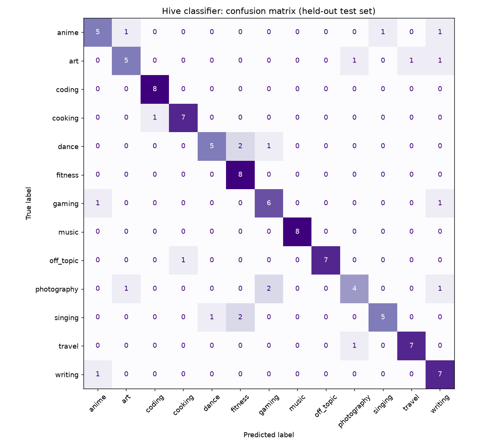

# Hive classifier — evaluation

520 synthetic posts, 13 classes, 80/20 stratified split (seed 42), data `c1ae12cc03ca`.

| Model | Accuracy | Macro-F1 |
|---|---|---|
| TF-IDF + logistic regression (words only) | 0.212 | 0.206 |
| Nearest centroid on embeddings (no training) | 0.779 | 0.776 |
| Embeddings + logistic regression (C=2) | 0.788 | 0.785 |

```
              precision    recall  f1-score   support

       anime      0.714     0.625     0.667         8
         art      0.714     0.625     0.667         8
      coding      0.889     1.000     0.941         8
     cooking      0.875     0.875     0.875         8
       dance      0.833     0.625     0.714         8
     fitness      0.667     1.000     0.800         8
      gaming      0.667     0.750     0.706         8
       music      1.000     1.000     1.000         8
   off_topic      1.000     0.875     0.933         8
 photography      0.667     0.500     0.571         8
     singing      0.833     0.625     0.714         8
      travel      0.875     0.875     0.875         8
     writing      0.636     0.875     0.737         8

    accuracy                          0.788       104
   macro avg      0.798     0.788     0.785       104
weighted avg      0.798     0.788     0.785       104
```



## Off-topic flag

Flag when P(own hive) < 0.13 and another label ≥ 0.30. Tuned on out-of-fold probabilities for ≤ 2% false alarms (≤ 5% on vague posts).

| | Recall | False alarms | False alarms (vague) | Precision |
|---|---|---|---|---|
| Calibration | 54.8% | 2.0% | 4.0% | 96.6% |
| Test | 65.4% | 3.3% | 4.0% | 94.4% |

## Misclassified test posts

- "That opening song has been stuck in my head for a week": anime → singing
- "Rule of thirds or center composition for this one?": photography → writing
- "My cat knocked over my coffee this morning": off_topic → cooking
- "Spice rack reorganized, now I can find everything": cooking → coding
- "The story twist in the final chapter got me": gaming → writing
- "Sunset from the temple steps": travel → photography
- "Belting without hurting my throat is still a mystery": singing → fitness
- "Breath support exercises are boring but they work": singing → fitness
- "My first wedding as second shooter, exhausting but fun": photography → gaming
- "My vibrato finally feels natural instead of forced": singing → dance
- "Portrait study: the eyes are good, the mouth is off": art → photography
- "Urban sketching trip in the old town": art → travel
- "Bought the art book and the key frames are gorgeous": anime → art
- "Show don't tell finally makes sense": writing → anime
- "Just pre-ordered the sequel, can't wait": gaming → anime
- "Finally landed a clean double pirouette after three weeks of drilling it": dance → gaming
- "Shooting in manual mode is starting to click": photography → gaming
- "Battle prep: working on transitions between power moves and footwork": dance → fitness
- "Breaking practice: windmills are destroying my back but worth it": dance → fitness
- "The ink bled through the paper, lesson learned": art → writing
- "Crying over a side character's backstory at 2am again": anime → writing
- "Black and white conversion brought out the texture": photography → art

## Real posts

44 posts: suggested hive correct 77.3%, flagged 4 (9.1%, all on-topic).

- "Week 4: 7 out of 10 clean doubles. Arms finally relaxed." (dance → fitness)
- "Golden hour on the way home made the commute worth it." (photography → travel)
- "Hit a note in warmups today I couldn't hit last month. Progress!" (singing → fitness)
- "Golden hour on the way home made the commute worth it." (photography → travel)
